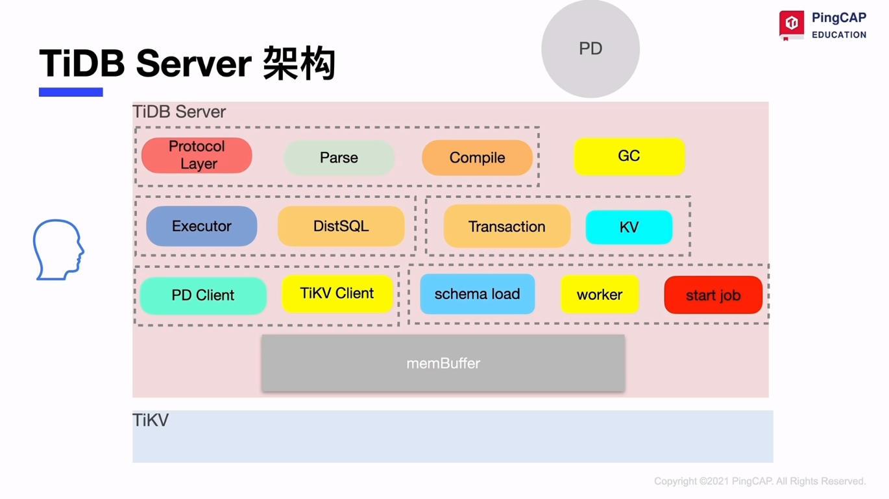
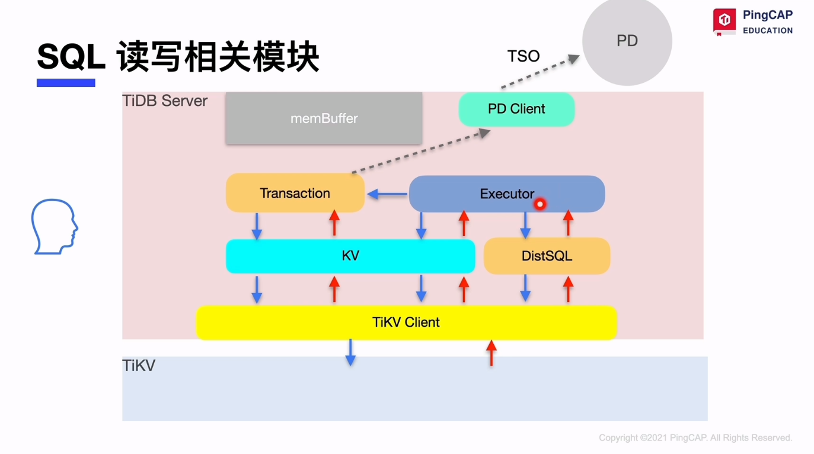
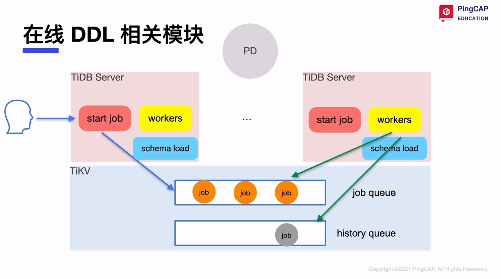
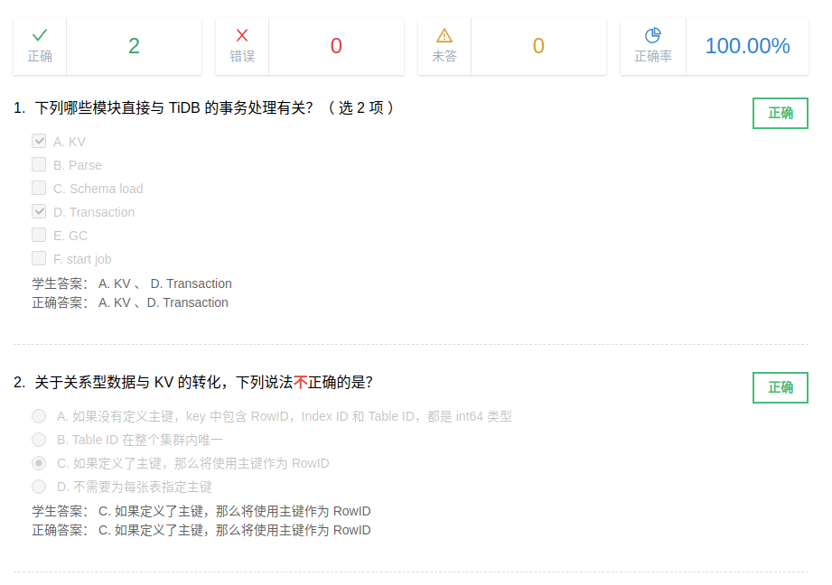

# TiDB server

## tidb server 架构

- sql 语句的解析和编译 parse

- sql 语句的解析和编译 compile: 验证，逻辑优化， 物理优化

- sql 读写相关模块

- 在线 ddl 相关模块

同一时间只有一个 tidb server 作为 owner 角色执行 job

- GC 机制及相关模块

tidb server 选一个 gc leader， safe point 时间戳以前的回收， 默认 gc_life_time = 10m

## tidb server 缓存

### 缓存组成

sql结果， 线程缓存， 元数据， 统计信息

### 缓存管理

tidb_mem_quota_query, oom-action

## 课堂小测验

