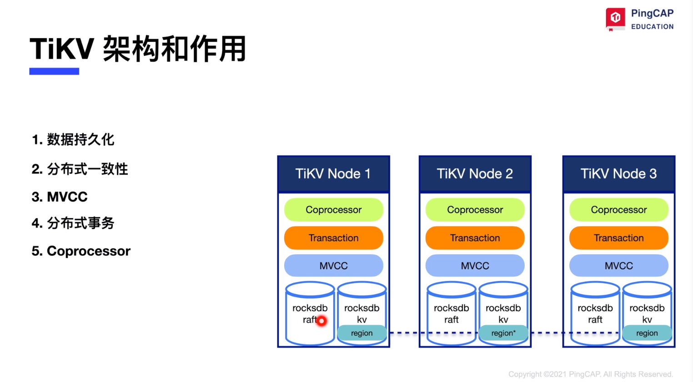
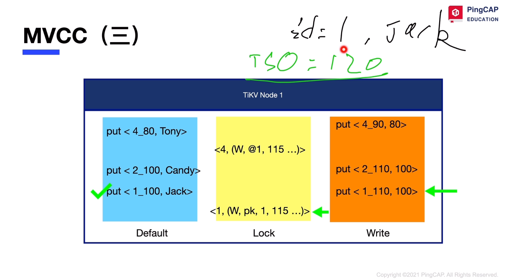

# TiKV

## part 1: 持久化

### tikv 架构和作用

### rocksdb

#### 写入(-)

内存： memtable -> immutable memtable ...

磁盘: 预写日志 wal,  sst

#### 写入(二)

写入友好，直接写新值即可

#### 查询

查询没那么友好， bloom 过滤器

#### 列簇 column family

## part 2: 分布式事务

### 分布式事务(一)

事务怎么存储在 tikv 中，乐观事务, 第一行加主锁. 如果一行数据小于 255 字节，直接存放在 write 列， 超过 255 字节的行存放在 default 列。

### 分布式事务(二)

分布式事务怎么处理原子性, 落脚点即只在第一行加主锁.

### MVCC(一)

多版本并发控制. 早期 tidb 乐观事务，乐观锁

### MVCC(二)

写入， 同下图

### MVCC(三)

读取，写不阻塞读

## part 3: raft

### raft 与 multi raft

leader， follower -> candidate, raft group, region 拆分 96M，144M [1, 1000)

### raft 日志复制

下图是 raft 的 commit， apply 后等价于是 sql 的 commit

### leader 选举

term, raft 共识算法的一个时间段，代表一个稳定的关系；election timeout = 10s; heartbeat timeout internal = 10s

## part 4: 读取:Coprocessor

### 数据的写入

本章聚焦在 raft 层， 以及 rocksdb raft -> rocksdb kv 层 的原理。

### 数据的读取

#### readindex read

发心跳，我是 leader 吗？

#### lease read

优化上面的发心跳，保证不发心跳也是 leader；也叫 local read。

#### follower read

原理同 index read，需要确保 follower 的 apply index 达到 commit index。

如果 follower 节点速度快于 leader 节点，则可能导致 follower 读取的比 leader 更快。

### coprocessor

计算下推， 协同处理器；支持物理算子， 分析采样等

## 课堂小测验

