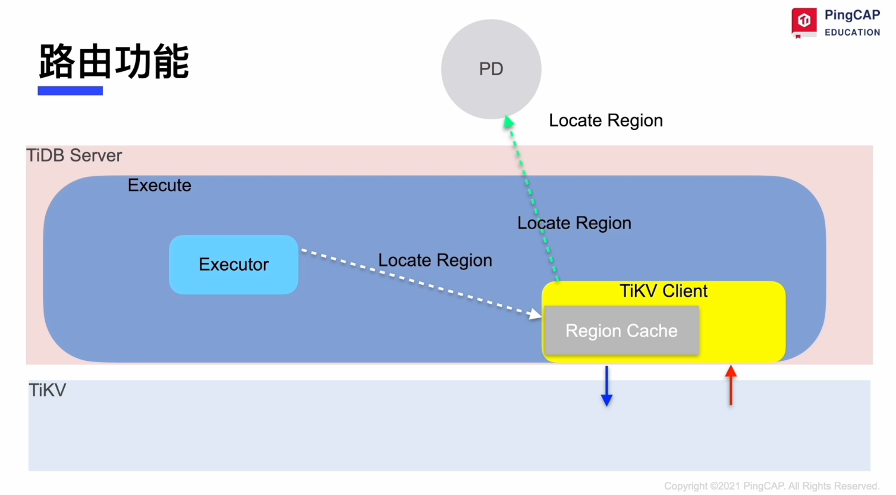
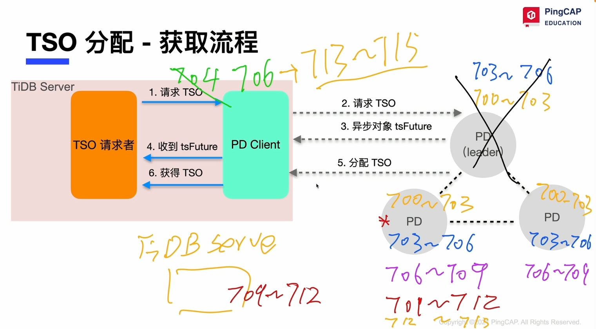
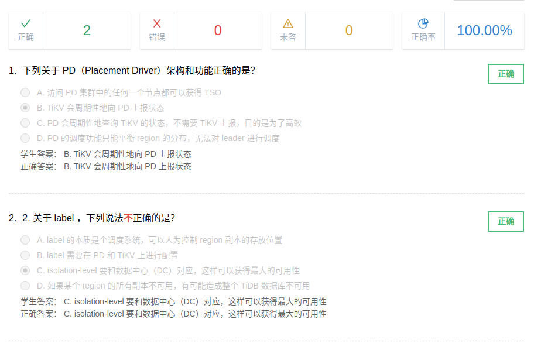

# PD 架构

pd 集群有多个节点组成， 但只有一个 leader. 图见 lesson_01 的概述。

## 路由功能

找到 leader region 在哪个 tikv；cache 失效， back off

## TSO

TSO = 物理时间 + 逻辑时间（1ms 分割为 262144个逻辑单元）， int64;

优化: 时间窗口

## 调度 - 总流程

信息收集: store heartbeat, region heartbeat

生成调度: banlance: leader, region; hot region; 集群拓扑; 缩容; 故障恢复; region merge

执行调度: 直接发到目标节点: 队列， 速度

## label 与 高可用

dc， rack， host， region；需要在 pd 和 tikv 配置

## 课堂小测验

