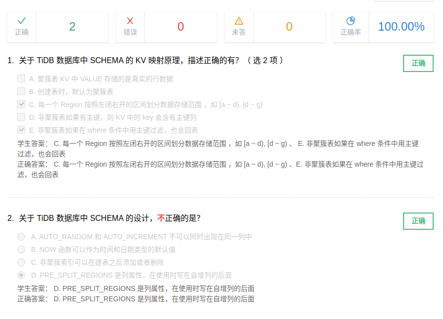

# tidb 数据库 sql 执行流程

## schema 的 kv 映射原理

聚簇表， value 不全， 主键在 rowid 中

非聚簇表， 值全在 value 中

## schema 的设计 - 聚簇表和非聚簇表

### 聚簇表

- 行数据顺序与主键顺序相同
- 主键为 key 的一部分
- 通过主键访问记录时， 可以直接获得行记录

### 非聚簇表

- 行数据顺序与主键顺序不一定相同
- 主键为 内部隐式 rowid
- 通过主键访问记录时， 不可以直接获得行记录。多一次回表操作。

非聚簇索引支持添加，删除

shard_row_id_bits

## 设计

高兼容性， 高性能

## 课堂小测验

